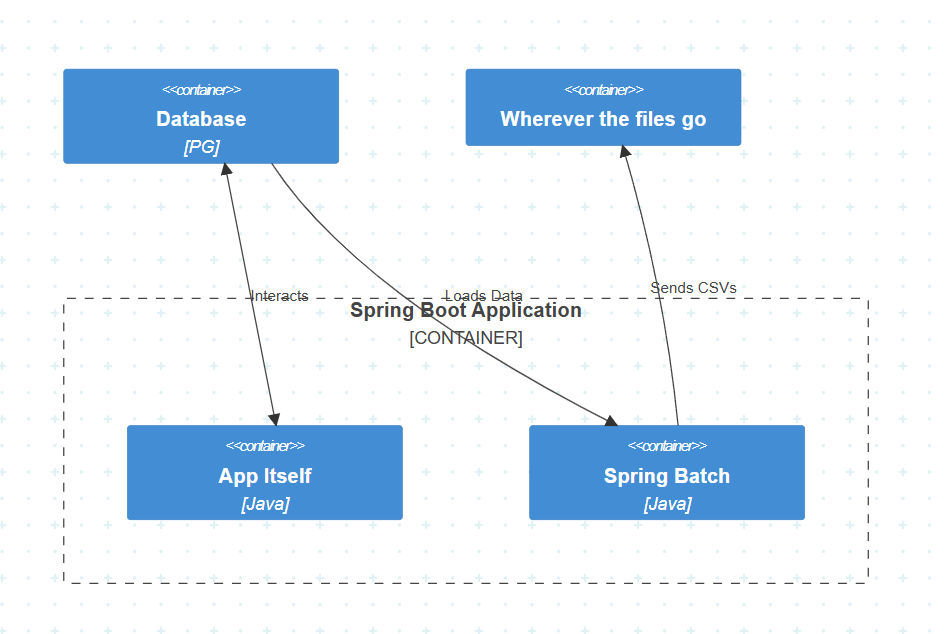

# Task 2

## Что выбрать?

Объем данных небольшой (5к - 10к), особо сложных операций с ними проводить не надо, запускается по расписанию.
Тут хватит базового in-app решения типа Spring Batch, при условии что не будет непредвиденных resource constraints и усложнений требований.

## C4

## Имплементация

При условии что мы не считаем что у нас будет нехватка компьют ресурсов, мы просто добавляем новый код в текущее приложение и все!
